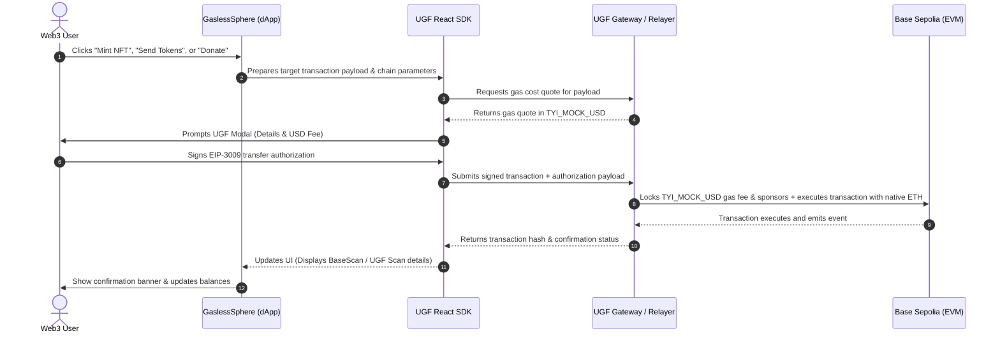

# 🌌 GaslessSphere — Entering an Era of Invisible Web3 Onboarding

GaslessSphere is a space-themed, gasless decentralized application (dApp) built on the **Base Sepolia Testnet** for the **HackwithMumbai 3.0** Hackathon. Powered by the **Universal Gas Framework (UGF)**, GaslessSphere demonstrates how standard EVM transactions (minting NFTs, sending tokens, and executing donations) can run smoothly without users needing to hold native gas tokens (ETH). Instead, transaction costs are settled on-the-fly via EIP-3009 signature authorizations and paid in **`TYI_MOCK_USD`**.

---

## 🚫 The Problem: The Native Gas Trap

Traditional Web3 onboarding suffers from a **"Funnel of Death"** that drives user conversion rates below **5%**:

1. **User Intent**: A user wants to claim a digital badge, support a creator, or test a dApp.
2. **KYC Barrier**: They are forced to sign up for a centralized exchange, complete identity verification, and link a bank account just to purchase crypto.
3. **Bridging Friction**: Moving native assets (ETH) across chains to pay for transaction gas adds complex, error-prone bridging steps.
4. **Volatile Pricing**: Calculating gas fees in Gwei and native tokens confuses and intimidates mainstream users.
5. **The Result**: Drop-offs at every step, leading to project failure.

### Developer Friction
Building custom account abstraction infrastructure (such as **ERC-4337 bundlers and paymasters**) is resource-intensive, highly complex, unstable across chains, and introduces heavy developer drain.

---

## 🚀 The Solution: Bypassing the Gas Trap via UGF

GaslessSphere replaces native gas requirements with a unified execution layer:

| Dimension | Status Quo (Native Gas) | GaslessSphere (UGF) |
| :--- | :--- | :--- |
| **Gas Currency** | Native ETH | Unified Mock Stablecoin (`TYI_MOCK_USD`) |
| **Onboarding Friction** | High (Requires KYC, bridging, and purchases) | **Zero** (One-click signature execution) |
| **Execution Model** | Local Wallet Execution | **Remote Execution Gateway** |
| **Developer Infra** | Complex (Custom ERC-4337 Bundlers/Paymasters) | **Simple** (UGF Plug-and-Play SDK) |

---

## 🛠️ Part 1: Technical Documentation & Workflow

### 1. Architectural Overview
GaslessSphere is a portal where all on-chain actions—such as minting custom NFTs, transferring assets, or making creator donations—are executed without requiring the user to hold native gas token (ETH). 

The transaction flow is governed by the **Universal Gas Framework (UGF)**, which quotes gas costs in real-time, collects an EIP-3009 signature from the user to pay for gas in `TYI_MOCK_USD`, and submits the transaction on-chain via UGF's remote execution gateway.



---

### 2. Deep Dive: Core Implementation Modules

#### A. Wallet Connection & Error Interception
The portal implements a custom hook [useWallet.ts](src/hooks/useWallet.ts) using **Ethers.js v6** to connect wallets and monitor state securely:

* **Auto-Initialization**: Silently fetches accounts on page load using `eth_accounts` without spamming connection prompts, preventing MetaMask window overlays on page refresh.
* **Reference-Stable Callbacks**: Memoizes functions (`connect`, `switchNetwork`, `refreshBalances`) using `useCallback` to prevent the infinite re-render loops (`Maximum update depth exceeded`) that frequently crash React dApps.
* **RPC Error Parser**: Translates raw Ethers wrapper exceptions into clean human messages via [parseWalletError](src/hooks/useWallet.ts#L10-L40):
  * **Error `-32002`**: Translates to `"Connection request already pending. Please open your MetaMask extension."`
  * **Error `4001`**: Translates to `"Connection request rejected."`

```typescript
export function parseWalletError(err: any): string {
  const errMsg = err?.message || '';
  const errCode = err?.code;
  const nestedError = err?.error || err?.info?.error || err?.info;
  const nestedCode = nestedError?.code;
  const nestedMessage = nestedError?.message || '';

  if (errCode === 4001 || nestedCode === 4001 || errMsg.toLowerCase().includes('rejected')) {
    return 'Connection request rejected.';
  }

  if (errCode === -32002 || nestedCode === -32002 || errMsg.toLowerCase().includes('already pending')) {
    return 'Connection request already pending. Please open your MetaMask extension.';
  }

  return nestedMessage || errMsg || 'An unknown error occurred.';
}
```

#### B. EIP-3009 Signature-Based Gas Settlement
Traditional gas sponsorship requires two on-chain transactions: `approve()` and `transferFrom()`. This introduces extra gas fees and double the signatures. GaslessSphere solves this with **EIP-3009 (Transfer With Authorization)**:
1. The user signs an off-chain authorization payload specifying the stablecoin gas fee.
2. The UGF Gateway submits this signature along with the user's target contract transaction.
3. The mock stablecoin contract verifies the signature and transfers the fee in a single atomic transaction.

#### C. Gasless Minting Flow
In [App.tsx](src/App.tsx#L187-L191), the minting function encodes the target smart contract action (e.g., `mint(to, tokenURI)`) dynamically:
1. Retrieves contract ABI from [SpaceNFT.json](src/constants/SpaceNFT.json).
2. Uses Ethers `Interface.encodeFunctionData` to build the transaction payload.
3. Invokes the `openUGF` method from `@tychilabs/react-ugf` to route the execution gaslessly.

```typescript
const contractInterface = new ethers.Interface(SpaceNFTJson.abi);
const txData = contractInterface.encodeFunctionData('mint', [nftRecipient, tokenUri]);

const tx = {
  to: nftContract,
  data: txData,
  value: 0n
};

openUGF({
  signer,
  tx,
  destChainId: '84532'
});
```

---

## 🎨 A Frictionless Ecosystem of On-Chain Actions

GaslessSphere implements four primary tracks to showcase UGF's remote execution:

### 1. Cosmic NFT Minter
Zero-gas minting of high-definition space art presets (such as *Cosmic Sentinel* or *Lunar Outpost*). Users claim digital collectibles without holding native tokens.

### 2. Gasless Token Sender
Transfer value (ETH) gaslessly to any address. UGF quotes the gas cost in USD, sponsors the destination gas fee, and collects the cost via a `TYI_MOCK_USD` stablecoin signature.

### 3. Space Initiatives Donations
Quick checkout portals supporting orbital station shielding, lunar hydroponics, and open-source development entirely gaslessly.

### 4. Developer Sandbox (DX Track)
Allows developers to dynamically compile and deploy personal custom 'Solidity' collections from the browser context, automatically populating UI dropdowns. Once deployed, NFTs can be minted on the new contract gaslessly.
* Dynamic factory deployment via compiler artifacts at [App.tsx](src/App.tsx#L282-L326) and Solidity contract [SpaceNFT.sol](src/contracts/SpaceNFT.sol).

---

## ⏳ Live Execution: Three-Click On-Chain Finality

1. **Step 1: Auto-Connect & Select**: Connect wallet via MetaMask (the portal triggers a chain switch to Base Sepolia automatically). Select the target preset art and compile the payload.
2. **Step 2: The UGF Modal**: Review the real-time gas fee quote (e.g. `$0.05 TYI_MOCK_USD`) and click **Sign** to authorize the UGF gateway transaction.
3. **Step 3: Instant Finality**: The UGF gateway relays the transaction. The UI displays the transaction hash, linking instantly to **BaseScan** and **UGF Scan**.

---

## 📊 Part 2: Pitch Presentation & Slides

If you are looking for the full pitch deck structure, problem statement slides, project roadmap, and presentation materials, they are structured professionally in the presentation PDF.

> [!TIP]
> ### 🌌 View Presentation Material
> Click here to access the presentation slides:
> **[GaslessSphere Pitch Deck & Presentation Slides (PDF)](./GaslessSphere.pdf)**

---

## ⚙️ Local Development Setup

### Prerequisites
* [Node.js](https://nodejs.org/) (v18+)
* MetaMask browser extension.

### Installation & Launch
1. Clone this repository:
   ```bash
   git clone <repository-url>
   cd microsoft-hackthon
   ```
2. Install the node packages:
   ```bash
   npm install
   ```
3. Run the development server:
   ```bash
   npm run dev
   ```
4. Access the portal at `http://localhost:5173`.
