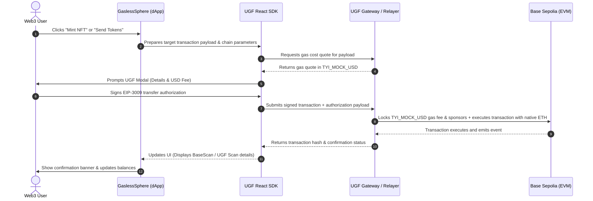

# 🌌 UGF Implementation Documentation & Presentation Outline

Welcome to the technical implementation guide and pitch presentation outline for **GaslessSphere**, built using the **Universal Gas Framework (UGF)** on the **Base Sepolia Testnet** for **HackwithMumbai 3.0**.

---

## 🛠️ Part 1: Technical Documentation & Workflow

### 1. Architectural Overview
GaslessSphere is a portal where all on-chain actions—such as minting custom NFTs, transferring assets, or making creator donations—are executed without requiring the user to hold native gas token (ETH). 

The transaction flow is governed by the **Universal Gas Framework (UGF)**, which quotes gas costs in real-time, collects an EIP-3009 signature from the user to pay for gas in `TYI_MOCK_USD`, and submits the transaction on-chain via UGF's remote execution gateway.

---

### 2. Deep Dive: Core Implementation Modules

#### A. Wallet Connection & Error Interception
The portal implements a custom hook [useWallet.ts](src/hooks/useWallet.ts) using **Ethers.js v6**. 
- **Auto-Initialization**: Silently fetches accounts on page load using `eth_accounts` without spamming connection prompts.
- **Reference-Stable Callbacks**: Memoizes functions (`connect`, `switchNetwork`, `refreshBalances`) using `useCallback` to prevent the infinite re-render loops (`Maximum update depth exceeded`) that frequently crash React dApps.
- **RPC Error Parser**: Translates raw Ethers wrapper exceptions into clean human messages via [parseWalletError](src/hooks/useWallet.ts#L10-L40):
  - **Error `-32002`**: Translates to `"Connection request already pending. Please open your MetaMask extension."`
  - **Error `4001`**: Translates to `"Connection request rejected."`

#### B. Gasless Minting Flow
In [App.tsx](src/App.tsx#L149-L198), the minting function encodes the target smart contract action (e.g., `mint(to, tokenURI)`) dynamically:
1. Retrieves contract ABI from [SpaceNFT.json](src/constants/SpaceNFT.json).
2. Uses Ethers `Interface.encodeFunctionData` to build the transaction payload.
3. Invokes the `openUGF` method from `@tychilabs/react-ugf` to route the execution gaslessly.

#### C. Developer Playground (Dynamic Compilation & Deployment)
For advanced judges, the dApp features a playground that compiles the Solidity source [SpaceNFT.sol](src/contracts/SpaceNFT.sol) on the fly via a compiler script [compile.js](scripts/compile.js). Users can deploy a custom collection copy, which automatically stores the address in local storage and populates the NFT selector dropdown.

---

## 📊 Part 2: Pitch Presentation (PPT) Outline

This structured 7-slide outline is designed to convey the core value, technical implementation, and commercial utility of GaslessSphere to hackathon judges.

### Slide 1: Cover Page
* **Title**: GaslessSphere — Reimagining Web3 Onboarding with UGF
* **Subtitle**: Seamless remote execution & gasless transactions on Base Sepolia
* **Presenter Info**: HackwithMumbai 3.0 Team
* **Visual Theme**: Deep space, glassmorphism, glowing accents (violet/cyan)

### Slide 2: The Friction (The Problem)
* **Heading**: Why Web3 Onboarding Fails Today
* **Core Points**:
  - **The Gas Trap**: Every simple action (minting a badge, voting, donating) requires users to buy, transfer, and hold native ETH.
  - **High Friction**: Buying ETH requires KYC, bridging, and dealing with volatile pricing. This kills 95%+ of user conversions.
  - **Bad Developer UX**: Building paymasters or managing ERC-4337 bundlers is overly complex for standard dApp developers.

### Slide 3: The Solution (The Innovation)
* **Heading**: GaslessSphere Powered by Universal Gas Framework
* **Core Points**:
  - **Zero ETH Required**: Users pay gas fees using a unified mock stablecoin (`TYI_MOCK_USD`) directly.
  - **Remote Execution Gateway**: Transactions are quoted, signed, settled, and executed in one click.
  - **No Complex Infrastructure**: Eliminates the need for custom ERC-4337 paymaster smart contracts.

### Slide 4: Core Product Features
* **Heading**: A Diverse Ecosystem of On-Chain Actions
* **Feature Grid**:
  - **Cosmic NFT Minter**: Zero-gas minting of high-definition space art presets.
  - **Gasless Token Sender**: Transfer value (ETH) without spending native tokens on fees.
  - **Space Initiatives Donations**: Quick checkout portals supporting hydroponics domes or station shielding gaslessly.
  - **Developer Sandbox**: Deploy personal custom collections dynamically, then interact with them gaslessly.

### Slide 5: The Underlying Architecture
* **Heading**: Technical Execution Layer
* **Bullet Points**:
  - **EIP-3009 Integration**: Leverages secure transfer authorizations, allowing gas payments via signature.
  - **Ethers.js v6 Interface**: Custom hooks utilizing memoized callback references for runtime stability.
  - **MetaMask RPC Resiliency**: Active catching of pending connections and rejections to ensure clean error messages.
  - **Solc Dynamic Compilation**: Dynamically bundles and deploys Solidity contracts directly from the browser context.

### Slide 6: Live Demo Walkthrough
* **Heading**: UX in Action
* **Step-by-Step Flow**:
  1. User logs in (MetaMask switches automatically to Base Sepolia).
  2. Minting a "Cosmic Sentinel" NFT: Ethers compiles transaction payload $\rightarrow$ UGF Modal prompts gas fee of $0.05 TYI_MOCK_USD $\rightarrow$ User signs $\rightarrow$ Completed instantly on BaseScan.
  3. UI dismissal alerts and real-time balance queries refresh flawlessly.

### Slide 7: Future Scope & Conclusion
* **Heading**: The Next Horizon of Gasless Execution
* **Points**:
  - **Cross-Chain UGF Routing**: Expanding from Base Sepolia to Optimism, Arbitrum, and Polygon Sepolia testnets.
  - **Stablecoin Gas Settlement**: Migrating from mock tokens to USDC and USDT for production mainnet deployment.
  - **Agentic Execution**: Enabling AI agents to sign transactions using UGF without holding private key balances.
* **Closing Line**: *"Bringing Web3 UX closer to the invisible design paradigms of Web2."*
